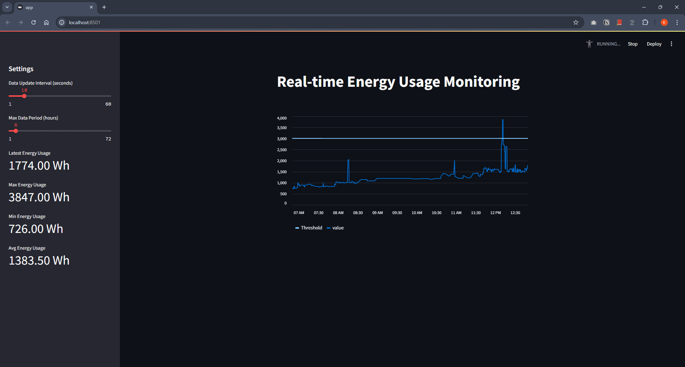

# Real-time Energy Usage Monitoring

This project monitors real-time energy usage using the Nature Remo API and sends notifications via LINE when the energy usage exceeds or falls below a specified threshold. The energy usage data is stored in an SQLite database and visualized using Streamlit.

## Features

- Real-time monitoring of energy usage
- Storage of energy usage data in an SQLite database
- Visualization of energy usage data with Streamlit
- LINE notifications when energy usage exceeds or falls below a threshold
- Graph attachment to LINE notifications

## Setup

1. Clone the repository:

    ```sh
    git clone https://github.com/yourusername/yourrepository.git
    cd yourrepository
    ```

2. Install Poetry if you haven't already:

    ```sh
    curl -sSL https://install.python-poetry.org | python3 -
    ```

3. Install the required packages:

    ```sh
    poetry install
    ```

4. Copy the `config.yaml.sample` file to `config.yaml` and update the values with your own Nature Remo API access token, database file path, request interval, threshold, LINE Notify access token, and notification settings:

    ```sh
    cp config.yaml.sample config.yaml
    ```

    Edit `config.yaml`:

    ```yaml
    # Configuration file for the application

    # Nature Remo API access token
    access_token: your_nature_remo_access_token_here

    # Path to the database file
    database_file: nature_remo_e_log.db

    # Request interval in seconds
    request_interval: 15

    # Threshold value in Wh
    threshold: 3000

    # LINE Notify access token
    line_token: your_line_notify_access_token_here

    # Enable or disable LINE notifications
    notify_enabled: true

    # Notification messages
    notify_message: "Energy usage exceeded the threshold. Please be mindful of your usage."
    notify_message_below_threshold: "Energy usage is below the threshold. Thank you for conserving energy."

    # Notification interval in seconds (default: 180 seconds)
    notify_interval: 180
    ```

## Usage

1. Run the data collector script to start collecting energy usage data:

    ```sh
    poetry run python data_collector.py
    ```

2. Run the Streamlit application to visualize the data:

    ```sh
    poetry run streamlit run app.py
    ```

## Testing

Run the tests using pytest:

    ```sh
    poetry run pytest
    ```

## Example

Below is an example of the UI generated by the Streamlit application, displaying the real-time energy usage data with metrics for latest, maximum, minimum, and average usage:



## Notes

- This application is compatible with Nature Remo E/E Lite.
- LINE notifications include a graph of energy usage.
- The configuration file (config.yaml) contains sensitive information. Make sure not to commit it to your Git repository.

## License

This project is licensed under the MIT License.